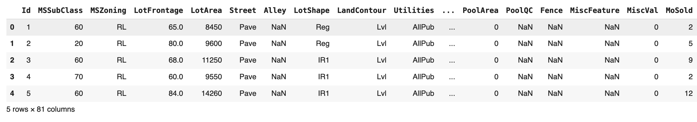

# Predicción de Precios de Bienes Raices en Australia - Regresión Avanzada

## Índice

- [Índice](#índice)
- [Introducción](#introducción)
  - [Métodos Utilizados](#métodos-utilizados)
  - [Tecnologías](#tecnologías)
- [Descarga y Configuración](#descarga-y-configuración)
  - [Requisitos Previos](#requisitos-previos)
  - [Cómo Ejecutar](#cómo-ejecutar)
- [Declaración del Problema](#declaración-del-problema)
  - [Objetivo Comercial](#objetivo-comercial)
  - [Preparación de Datos:](#preparación-de-datos)
  - [Construcción y Evaluación del Modelo](#construcción-y-evaluación-del-modelo)
  - [Conclusiones](#conclusiones)
    - [Regresión Ridge](#regresión-ridge)
    - [Regresión Lasso](#regresión-lasso)
    - [Regresión ElasticNet](#regresión-lasso)
    - [Las Variables Más Significativas Son:](#las-variables-más-significativas-son)

## Introducción

Maestria en Ciencia de Datos 5v
**Machine Learning**

### **Integrates de Grupo:**
  
  ### Grupo D
  ### Dimensionality Reduction

  * Javier Alejandro Velasco Villarroel
  * Juan Fernando Mamani Huayhua
  * Estanislao Guido Paco Ramos

...

### Métodos Utilizados

1. Limpieza de Datos

    Descripción: Es el proceso para asegurar la calidad del dataset antes del análisis.
    Técnicas aplicadas:
        Manejo de valores nulos: Eliminación o imputación de valores faltantes usando medias, medianas u otros métodos.
        Estandarización de variables: Transformación de datos para que todas las variables estén en la misma escala.
        Revisión de inconsistencias: Identificación de duplicados, datos mal tipados o fuera del rango esperado.

2. Identificación y Ajuste de Outliers

    Identificación:
        Boxplot: Detecta valores extremos mediante los cuartiles (valores fuera del rango [Q1 - 1.5 IQR, Q3 + 1.5 IQR]).
        Métodos estadísticos: Uso de z-scores para detectar valores a más de 3 desviaciones estándar de la media.

    Ajuste de Outliers:
        Winsorización: Reemplazo de valores extremos por el límite superior/inferior permitido.
        Imputación: Sustitución de outliers con la mediana o media.
        Eliminación: Remover datos que no sean representativos si se justifica.

3. Análisis Exploratorio de Datos (EDA)

    Descripción: Proceso para entender las características generales de los datos, detectar patrones y anomalías.
    Técnicas utilizadas:
        Análisis univariable: Inspección de cada variable individualmente (tendencia central, dispersión, distribución).
        Análisis bivariable: Relación entre dos variables para encontrar correlaciones.
        Análisis multivariable: Análisis de múltiples variables simultáneamente para detectar interacciones complejas.

4. Gráficos Utilizados

    Boxplot: Visualiza la dispersión de datos y detecta outliers.
    Histogramas: Muestra la distribución de una variable.
    Gráficos de dispersión (scatter plots): Ilustra la relación entre dos variables numéricas.
    Heatmaps: Visualiza correlaciones entre variables en forma de matriz.
    Pairplots: Muestra relaciones bivariadas entre múltiples variables.

5. Modelos Utilizados

**Ridge Regression (Regresión Ridge)**

    Es una extensión de la regresión lineal que añade regularización L2.
    Penaliza la magnitud de los coeficientes, reduciendo los que son muy grandes para evitar el sobreajuste.
    Controla la complejidad del modelo a través del hiperparámetro alpha (λ). A mayor alpha, más regularización se aplica.

    Uso ideal: Cuando hay colinealidad entre las variables independientes o se busca evitar que los coeficientes crezcan demasiado.

**Lasso Regression (Least Absolute Shrinkage and Selection Operator)**

    Similar a Ridge, pero utiliza regularización L1.
    Además de evitar el sobreajuste, Lasso tiende a hacer algunos coeficientes exactamente cero, seleccionando solo las variables más importantes.
    Esto lo convierte en una herramienta útil para la selección de características.

    Uso ideal: Cuando se necesita reducir el número de variables predictoras y mantener solo las más relevantes.

**ElasticNet Regression**

    Combina L1 (Lasso) y L2 (Ridge) en una única función de penalización, controlada por los parámetros alpha (fuerza de regularización) y l1_ratio (proporción entre L1 y L2).
    Es útil cuando ni Lasso ni Ridge por sí solos ofrecen un rendimiento óptimo.

Uso ideal: Cuando las características están correlacionadas y se requiere un equilibrio entre selección de variables y regularización de coeficientes.

6. Métricas para la Evaluación de Modelos

**R2 (Coeficiente de determinación):**
    
    Mide la proporción de la variación en la variable dependiente explicada por el modelo.
        Un valor de R2 cercano a 1 indica que el modelo es bueno explicando la variabilidad de los datos.
        Aquí, los tres modelos tienen valores similares en los conjuntos de entrenamiento y prueba (alrededor de 0.68), lo que indica que todos capturan la estructura de los datos de manera similar.
        La similitud entre R2 de entrenamiento y prueba sugiere que no hay sobreajuste.

**RMSE (Root Mean Squared Error):**
    
    Es la raíz cuadrada del error cuadrático medio y mide cuánto se desvía la predicción del valor real.
        Menores valores de RMSE indican mejores predicciones.
        Los modelos presentan valores similares (alrededor de 33,500), lo que indica que no hay una diferencia sustancial en precisión.

**Alpha (Lambda):**
    
    Es el hiperparámetro que controla la magnitud de la regularización:
        Valores más altos de alpha implican mayor penalización y un modelo más simple para evitar el sobreajuste.

### Tecnologías

**Python**

    Es un lenguaje de programación interpretado y de alto nivel, muy popular por su simplicidad y versatilidad.
    Ideal para desarrollo de aplicaciones, análisis de datos, machine learning y más.

    Uso en este proyecto: Desarrollo de modelos de regresión y manipulación de datos.

**Pandas**

    Biblioteca de Python diseñada para la manipulación y análisis de datos.
    Permite trabajar con estructuras como DataFrames (tablas) y Series (listas con índices), facilitando tareas como filtrado, agrupación, y transformación de datos.

    Uso en este proyecto: Cargar, limpiar, y organizar los datos para alimentar los modelos.

**NumPy**

    Biblioteca especializada en cálculo numérico con soporte para arreglos multidimensionales (arrays).
    Ofrece herramientas para álgebra lineal, funciones matemáticas y transformaciones rápidas.

    Uso en este proyecto: Realización de cálculos matemáticos y manejo eficiente de arrays.

**Scikit-Learn**

    Biblioteca de machine learning en Python que contiene algoritmos de clasificación, regresión, clustering, y reducción de dimensionalidad.
    Incluye herramientas para preprocesamiento, evaluación de modelos, y selección de hiperparámetros.

    Uso en este proyecto: Implementación de los modelos Ridge, Lasso y ElasticNet, y evaluación con métricas como RMSE y R2.

**Matplotlib / Seaborn**

    Bibliotecas para la visualización de datos en Python.
        Matplotlib: Soporta gráficos de bajo nivel (líneas, barras, dispersión, etc.).
        Seaborn: Extiende Matplotlib con gráficos estadísticos más sofisticados y atractivos.

    Uso en este proyecto: Crear visualizaciones para comparar los resultados entre los modelos.

## Descarga y Configuración

### Requisitos Previos

Se requiere que esté instalado previamente:

* Colab
* Python version 3
* Git

### Cómo Ejecutar

Puede descargar el código fuente clonando este repositorio usando Git:

1. Abra su aplicación Terminal favorita (Unix, Linux o Macos), como Terminal, Comando, Consola, iTerm2, etc.

2. Clone el repositorio

https://github.com/guidjhonsen/MachineLearning.git

3. Subir el archivo notebook Proyecto1_ML.ipynb con COLAB.

## Declaración del Problema

### Objetivo Comercial

El objetivo comercial principal es maximizar la rentabilidad y reducir riesgos para todas las partes involucradas: desarrolladores, bancos, inversionistas y compradores. Además, fomenta la eficiencia del mercado inmobiliario, facilitando decisiones bien informadas para todas las partes.

### Preparación de Datos:

Una empresa de vivienda con sede en EE. UU. llamada Surprise Housing ha decidido ingresar al mercado australiano. La empresa utiliza el análisis de datos para comprar casas a un precio inferior a sus valores reales y venderlas a un precio más alto. Con el mismo propósito, la empresa ha recopilado un conjunto de datos de la venta de casas en Australia. Los datos se proporcionan en el archivo CSV a continuación.

La compañía está buscando posibles propiedades para comprar e ingresar al mercado. Debe construir un modelo de regresión utilizando la regularización para predecir el valor real de las posibles propiedades y decidir si invertir en ellas o no.

La empresa quiere saber:

    Qué variables son significativas para predecir el precio de una casa, y
    Qué tan bien esas variables describen el precio de una casa.

**Descripcion de campos del dataset**

    MSSubClass: Identifica el tipo de vivienda involucrada en la venta.
        20: 1 piso, 1946 y nuevo, todos los estilos.
        30: 1 piso, 1945 y más viejo.
        40: 1 piso con ático terminado, todas las edades.
        45: 1.5 pisos, sin terminar, todas las edades.
        50: 1.5 pisos, terminado, todas las edades.
        60: 2 pisos, 1946 y nuevo.
        70: 2 pisos, 1945 y más viejo.
        75: 2.5 pisos, todas las edades.
        80: División o múltiples niveles.
        85: Foyer dividido.
        90: Dúplex - todos los estilos y edades.
        120: 1 piso PUD (Desarrollo de Unidad Planificada) - 1946 y nuevo.
        150: 1.5 pisos PUD - todas las edades.
        160: 2 pisos PUD - 1946 y nuevo.
        180: PUD - multilevel - incluyendo división de niveles/foyer.
        190: Conversión de 2 familias - todos los estilos y edades.

    MSZoning: Identifica la clasificación de zonificación general de la venta.
        A: Agricultura
        C: Comercial
        FV: Residencial en pueblo flotante
        I: Industrial
        RH: Residencial de alta densidad
        RL: Residencial de baja densidad
        RP: Parque de baja densidad residencial
        RM: Residencial de densidad media

    LotFrontage: Pies lineales de calle conectados a la propiedad.

    LotArea: Tamaño del lote en pies cuadrados.

    Street: Tipo de acceso a la propiedad.
        Grvl: Grava
        Pave: Pavimentado

    Alley: Tipo de acceso por callejón a la propiedad.
        Grvl: Grava
        Pave: Pavimentado
        NA: Sin acceso por callejón

    LotShape: Forma general de la propiedad.
        Reg: Regular
        IR1: Ligeramente irregular
        IR2: Moderadamente irregular
        IR3: Irregular

    LandContour: Planicidad de la propiedad.
        Lvl: Cerca de plano/nivel
        Bnk: Elevación rápida y significativa desde la calle al edificio
        HLS: Pendiente significativa de lado a lado
        Low: Depresión

    Utilities: Tipo de servicios públicos disponibles.
        AllPub: Todos los servicios públicos (electricidad, gas, agua, y saneamiento)
        NoSewr: Electricidad, gas y agua (tanque séptico)
        NoSeWa: Solo electricidad y gas
        ELO: Solo electricidad

    LotConfig: Configuración del lote.
        Inside: Lote interior
        Corner: Lote en esquina
        CulDSac: Calle sin salida
        FR2: Frente en 2 lados de la propiedad
        FR3: Frente en 3 lados de la propiedad

    LandSlope: Pendiente de la propiedad.
        Gtl: Pendiente suave
        Mod: Pendiente moderada
        Sev: Pendiente severa

    Neighborhood: Ubicaciones físicas dentro de los límites de la ciudad de Ames.
        Varias zonas con nombres específicos como Bloomington Heights, College Creek, etc.

    Condition1: Proximidad a varias condiciones.
        Artery: Adyacente a calle arterial
        Feedr: Adyacente a calle alimentadora
        Norm: Normal
        RRNn: Dentro de 200' de ferrocarril norte-sur
        RRAn: Adyacente a ferrocarril norte-sur
        PosN: Cerca de característica positiva fuera del sitio (parque, zona verde, etc.)
        PosA: Adyacente a característica positiva fuera del sitio
        RRNe: Dentro de 200' de ferrocarril este-oeste
        RRAe: Adyacente a ferrocarril este-oeste

    Condition2: Proximidad a varias condiciones (si hay más de una presente).

    BldgType: Tipo de vivienda.
        1Fam: Casa unifamiliar independiente
        2FmCon: Conversión de dos familias; originalmente construida como una vivienda unifamiliar
        Duplx: Dúplex
        TwnhsE: Unidad final de casa adosada
        TwnhsI: Unidad interior de casa adosada

    HouseStyle: Estilo de la vivienda.
        1Story: Un piso
        1.5Fin: Un piso y medio: segundo nivel terminado
        1.5Unf: Un piso y medio: segundo nivel sin terminar
        2Story: Dos pisos
        2.5Fin: Dos pisos y medio: segundo nivel terminado
        2.5Unf: Dos pisos y medio: segundo nivel sin terminar
        SFoyer: Foyer dividido
        SLvl: Nivel dividido

    OverallQual: Calificación del material y acabado general de la casa.
        10: Muy excelente
        9: Excelente
        8: Muy bueno
        7: Bueno
        6: Superior a la media
        5: Promedio
        4: Por debajo de la media
        3: Justo
        2: Pobre
        1: Muy pobre

    OverallCond: Calificación de la condición general de la casa (similar a OverallQual).

    YearBuilt: Fecha de construcción original.

    YearRemodAdd: Fecha de remodelación (igual a la fecha de construcción si no hay remodelaciones o adiciones).

    RoofStyle: Tipo de techo.
        Flat: Plano
        Gable: A dos aguas
        Gambrel: Techo de granero
        Hip: Techo a cuatro aguas
        Mansard: Techo mansardado
        Shed: Techo a un agua

    RoofMatl: Material del techo.
        ClyTile: Teja o cerámica
        CompShg: Tejas compuestas estándar
        Membran: Membrana
        Metal: Metal
        Roll: Rollos
        Tar&Grv: Grava y alquitrán
        WdShake: Madera en tablones
        WdShngl: Tejas de madera

    Exterior1st: Cubierta exterior de la casa.

    Exterior2nd: Cubierta exterior de la casa (si hay más de un material).

    MasVnrType: Tipo de revestimiento de mampostería.
        BrkCmn: Ladrillo común
        BrkFace: Ladrillo visto
        CBlock: Bloque de concreto
        None: Ninguno
        Stone: Piedra

    MasVnrArea: Área de revestimiento de mampostería en pies cuadrados.

    ExterQual: Evalúa la calidad del material en el exterior.
        Ex: Excelente
        Gd: Bueno
        TA: Promedio/típico
        Fa: Justo
        Po: Pobre

    ExterCond: Evalúa la condición actual del material en el exterior.

    Foundation: Tipo de fundación.
        BrkTil: Ladrillo y azulejo
        CBlock: Bloque de concreto
        PConc: Concreto vertido
        Slab: Losa
        Stone: Piedra
        Wood: Madera

    BsmtQual: Evalúa la altura del sótano.
        Ex: Excelente (más de 100 pulgadas)
        Gd: Bueno (90-99 pulgadas)
        TA: Típico (80-89 pulgadas)
        Fa: Justo (70-79 pulgadas)
        Po: Pobre (menos de 70 pulgadas)
        NA: Sin sótano

    BsmtCond: Evalúa la condición general del sótano.

    BsmtExposure: Se refiere a las paredes de nivel de jardín o salida.

    BsmtFinType1: Calificación del área terminada del sótano.

    BsmtFinSF1: Pies cuadrados terminados del tipo 1.

    BsmtFinType2: Calificación del área terminada del sótano (si hay múltiples tipos).

    BsmtFinSF2: Pies cuadrados terminados del tipo 2.

    BsmtUnfSF: Pies cuadrados no terminados del sótano.

    TotalBsmtSF: Total de pies cuadrados del sótano.

    Heating: Tipo de calefacción.
        GasA: Gas de área
        GasW: Gas de agua
        Grav: Gravilla
        OthW: Otros
        Wall: Calefacción en la pared

    HeatingQC: Calidad del sistema de calefacción.

    CentralAir: Tipo de aire acondicionado.
        Y: Sí
        N: No

    Electrical: Sistema eléctrico.
        SBrkr: Interruptor de circuito estándar
        FuseA: Fusibles
        FuseF: Fusibles de tipo especial
        Mix: Mezcla

    FirstFlrSF: Área del primer piso en pies cuadrados.

    SecondFlrSF: Área del segundo piso en pies cuadrados.

    LowQualFinSF: Pies cuadrados de área de calidad inferior (cualquier piso).

    GrLivArea: Área habitable por encima del suelo en pies cuadrados.

    BsmtFullBath: Cantidad de baños completos en el sótano.

    BsmtHalfBath: Cantidad de baños a medio baño en el sótano.

    FullBath: Cantidad de baños completos en la casa.

    HalfBath: Cantidad de medios baños en la casa.

    Bedroom: Cantidad de dormitorios.

    Kitchen: Cantidad de cocinas.

    KitchenQual: Calidad de la cocina.

    TotRmsAbvGrd: Total de habitaciones por encima del suelo (sin incluir baños).

    Functional: Calificación de funcionalidad general de la casa.
        Typ: Típico
        Min1: Necesita reparaciones
        Min2: Necesita reparaciones significativas
        Mod: Modificado
        All: Todas las habitaciones son útiles
        Sev: Severamente comprometido
        Sal: Saludable, pero podría usar cambios significativos

    Fireplaces: Cantidad de chimeneas.

    FireplaceQu: Calificación de la chimenea.

    GarageType: Tipo de garaje.
        Attchd: Garaje adjunto
        Detchd: Garaje separado
        BuiltIn: Garaje integrado
        Basement: Garaje en el sótano
        NA: Sin garaje

    GarageFinish: Calificación del acabado del garaje.

    GarageCars: Cantidad de autos que caben en el garaje.

    GarageArea: Área del garaje en pies cuadrados.

    GarageQual: Calificación de calidad del garaje.

    PavedDrive: Indica si hay una entrada pavimentada.
        Y: Sí
        P: Parcial
        N: No

    WoodDeckSF: Área del deck de madera en pies cuadrados.

    OpenPorchSF: Área del porche abierto en pies cuadrados.

    EnclosedPorchSF: Área del porche cerrado en pies cuadrados.

    3SsnPorchSF: Área del porche de tres estaciones en pies cuadrados.

    ScreenPorchSF: Área del porche con pantalla en pies cuadrados.

    PoolQC: Calificación de la calidad de la piscina.

    Fence: Tipo de cercado.

    MiscFeature: Características adicionales (garajes, cubiertas, etc.).

    MiscVal: Valor monetario de las características misceláneas.

    MoSold: Mes de venta.

    YrSold: Año de venta.

    SaleType: Tipo de venta.
        WD: Venta regular
        New: Nuevo
        COD: Efectivo
        Con: Venta a crédito
        ConLw: Venta a crédito a bajo interés
        Oth: Otro

    SalePrice: Precio de venta de la propiedad.

El dataset proporciona una amplia variedad de variables que afectan el precio de las propiedades en el mercado australiano.

    Número de filas: 1460
    Número de columnas: 81

1. Limpieza de Datos y Análisis de Datos Faltantes.

Valores nulos:

    Valores nulos por columna:
    Id                 0
    MSSubClass         0
    MSZoning           0
    LotFrontage      259
    LotArea            0
                    ... 
    MoSold             0
    YrSold             0
    SaleType           0
    SaleCondition      0
    SalePrice          0
    Length: 81, dtype: int64

Corrección de datos nulos con la mediana y esstadistica de cada variable

    Shape del dataset: (1460, 81)

                    Id   MSSubClass  LotFrontage        LotArea  OverallQual  \
    count  1460.000000  1460.000000  1460.000000    1460.000000  1460.000000   
    mean    730.500000    56.897260    69.863699   10516.828082     6.099315   
    std     421.610009    42.300571    22.027677    9981.264932     1.382997   
    min       1.000000    20.000000    21.000000    1300.000000     1.000000   
    25%     365.750000    20.000000    60.000000    7553.500000     5.000000   
    50%     730.500000    50.000000    69.000000    9478.500000     6.000000   
    75%    1095.250000    70.000000    79.000000   11601.500000     7.000000   
    max    1460.000000   190.000000   313.000000  215245.000000    10.000000   

        OverallCond    YearBuilt  YearRemodAdd   MasVnrArea   BsmtFinSF1  ...  \
    count  1460.000000  1460.000000   1460.000000  1460.000000  1460.000000  ...   
    mean      5.575342  1971.267808   1984.865753   103.117123   443.639726  ...   
    std       1.112799    30.202904     20.645407   180.731373   456.098091  ...   
    min       1.000000  1872.000000   1950.000000     0.000000     0.000000  ...   
    25%       5.000000  1954.000000   1967.000000     0.000000     0.000000  ...   
    50%       5.000000  1973.000000   1994.000000     0.000000   383.500000  ...   
    75%       6.000000  2000.000000   2004.000000   164.250000   712.250000  ...   
    max       9.000000  2010.000000   2010.000000  1600.000000  5644.000000  ...   

            WoodDeckSF  OpenPorchSF  EnclosedPorch    3SsnPorch  ScreenPorch  \
    count  1460.000000  1460.000000    1460.000000  1460.000000  1460.000000   
    mean     94.244521    46.660274      21.954110     3.409589    15.060959   
    std     125.338794    66.256028      61.119149    29.317331    55.757415   
    min       0.000000     0.000000       0.000000     0.000000     0.000000   
    25%       0.000000     0.000000       0.000000     0.000000     0.000000   
    50%       0.000000    25.000000       0.000000     0.000000     0.000000   
    75%     168.000000    68.000000       0.000000     0.000000     0.000000   
    max     857.000000   547.000000     552.000000   508.000000   480.000000   

            PoolArea       MiscVal       MoSold       YrSold      SalePrice  
    count  1460.000000   1460.000000  1460.000000  1460.000000    1460.000000  
    mean      2.758904     43.489041     6.321918  2007.815753  180921.195890  
    std      40.177307    496.123024     2.703626     1.328095   79442.502883  
    min       0.000000      0.000000     1.000000  2006.000000   34900.000000  
    25%       0.000000      0.000000     5.000000  2007.000000  129975.000000  
    50%       0.000000      0.000000     6.000000  2008.000000  163000.000000  
    75%       0.000000      0.000000     8.000000  2009.000000  214000.000000  
    max     738.000000  15500.000000    12.000000  2010.000000  755000.000000

2. Análisis y Tratamiento de Valores Atípicos.

Identificacion de valores atipicos

Variables atipicos:

    Outliers detectados por variable:
    Id: 0 outliers detectados
    MSSubClass: 103 outliers detectados
    LotFrontage: 106 outliers detectados
    LotArea: 69 outliers detectados
    OverallQual: 2 outliers detectados
    OverallCond: 125 outliers detectados
    YearBuilt: 7 outliers detectados
    YearRemodAdd: 0 outliers detectados
    MasVnrArea: 98 outliers detectados
    BsmtFinSF1: 7 outliers detectados
    BsmtFinSF2: 167 outliers detectados
    BsmtUnfSF: 29 outliers detectados
    TotalBsmtSF: 61 outliers detectados
    1stFlrSF: 20 outliers detectados
    2ndFlrSF: 2 outliers detectados
    LowQualFinSF: 26 outliers detectados
    GrLivArea: 31 outliers detectados
    BsmtFullBath: 1 outliers detectados
    BsmtHalfBath: 82 outliers detectados
    FullBath: 0 outliers detectados
    HalfBath: 0 outliers detectados
    BedroomAbvGr: 35 outliers detectados
    KitchenAbvGr: 68 outliers detectados
    TotRmsAbvGrd: 30 outliers detectados
    Fireplaces: 5 outliers detectados
    GarageYrBlt: 1 outliers detectados
    GarageCars: 5 outliers detectados
    GarageArea: 21 outliers detectados
    WoodDeckSF: 32 outliers detectados
    OpenPorchSF: 77 outliers detectados
    EnclosedPorch: 208 outliers detectados
    3SsnPorch: 24 outliers detectados
    ScreenPorch: 116 outliers detectados
    PoolArea: 7 outliers detectados
    MiscVal: 52 outliers detectados
    MoSold: 0 outliers detectados
    YrSold: 0 outliers detectados
    SalePrice: 61 outliers detectados

Corrección de valores atípicos mediante el rango intercuartilico:

El método basado en rangos intercuartílicos es una técnica estadística para identificar y tratar valores atípicos (outliers) en los datos. Un valor atípico es una observación que se desvía significativamente del resto de los datos, lo que puede afectar el rendimiento de los modelos de machine learning.

La corrección de valores atípicos, se hizo por reemplazo de los límites, se sustituyeron los valores atípicos con el valor máximo o mínimo permitido por los límites.

    Reporte de Outliers Después de la Corrección:
    Id: 0 outliers
    MSSubClass: 0 outliers
    LotFrontage: 89 outliers
    LotArea: 54 outliers
    OverallQual: 0 outliers
    OverallCond: 0 outliers
    YearBuilt: 0 outliers
    YearRemodAdd: 0 outliers
    MasVnrArea: 119 outliers
    BsmtFinSF1: 1 outliers
    BsmtFinSF2: 0 outliers
    BsmtUnfSF: 13 outliers
    TotalBsmtSF: 14 outliers
    1stFlrSF: 6 outliers
    2ndFlrSF: 0 outliers
    LowQualFinSF: 0 outliers
    GrLivArea: 10 outliers
    BsmtFullBath: 0 outliers
    BsmtHalfBath: 0 outliers
    FullBath: 0 outliers
    HalfBath: 0 outliers
    BedroomAbvGr: 0 outliers
    KitchenAbvGr: 0 outliers
    TotRmsAbvGrd: 0 outliers
    Fireplaces: 0 outliers
    GarageYrBlt: 0 outliers
    GarageCars: 0 outliers
    GarageArea: 0 outliers
    WoodDeckSF: 8 outliers
    OpenPorchSF: 48 outliers
    EnclosedPorch: 0 outliers
    3SsnPorch: 0 outliers
    ScreenPorch: 0 outliers
    PoolArea: 0 outliers
    MiscVal: 0 outliers
    MoSold: 0 outliers
    YrSold: 0 outliers
    SalePrice: 48 outliers

3. Derivación de Columnas Categóricas.

La derivación de variables categóricas consiste en transformar estas variables en una forma que los algoritmos de Machine Learning puedan utilizar, generalmente mediante codificación.

Variables categóricas: 

    ['MSZoning', 'Street', 'Alley', 'LotShape', 'LandContour', 'Utilities', 'LotConfig', 'LandSlope', 'Neighborhood', 'Condition1', 'Condition2', 'BldgType', 'HouseStyle', 'RoofStyle', 'RoofMatl', 'Exterior1st', 'Exterior2nd', 'MasVnrType', 'ExterQual', 'ExterCond', 'Foundation', 'BsmtQual', 'BsmtCond', 'BsmtExposure', 'BsmtFinType1', 'BsmtFinType2', 'Heating', 'HeatingQC', 'CentralAir', 'Electrical', 'KitchenQual', 'Functional', 'FireplaceQu', 'GarageType', 'GarageFinish', 'GarageQual', 'GarageCond', 'PavedDrive', 'PoolQC', 'Fence', 'MiscFeature', 'SaleType', 'SaleCondition']

    DataFrame después de One-Hot Encoding:
    Id  MSSubClass  LotFrontage  LotArea  OverallQual  OverallCond  YearBuilt  \
    0   1        60.0         65.0   8450.0          7.0          5.0     2003.0   
    1   2        20.0         80.0   9600.0          6.0          5.0     1976.0   
    2   3        60.0         68.0  11250.0          7.0          5.0     2001.0   
    3   4        70.0         60.0   9550.0          7.0          5.0     1915.0   
    4   5        60.0         84.0  14260.0          8.0          5.0     2000.0   

    YearRemodAdd  MasVnrArea  BsmtFinSF1  ...  SaleType_ConLI  SaleType_ConLw  \
    0          2003       196.0       706.0  ...           False           False   
    1          1976         0.0       978.0  ...           False           False   
    2          2002       162.0       486.0  ...           False           False   
    3          1970         0.0       216.0  ...           False           False   
    4          2000       350.0       655.0  ...           False           False   

    SaleType_New  SaleType_Oth  SaleType_WD  SaleCondition_AdjLand  \
    0         False         False         True                  False   
    1         False         False         True                  False   
    2         False         False         True                  False   
    3         False         False         True                  False   
    4         False         False         True                  False  

    SaleCondition_Alloca  SaleCondition_Family  SaleCondition_Normal  \
    0                 False                 False                  True   
    1                 False                 False                  True   
    2                 False                 False                  True   
    3                 False                 False                 False   
    4                 False                 False                  True   

    SaleCondition_Partial  
    0                  False  
    1                  False  
    2                  False  
    3                  False  
    4                  False  

    [5 rows x 246 columns]

    DataFrame después de Label Encoding:
    Id  MSSubClass  MSZoning  LotFrontage  LotArea  Street  Alley  LotShape  \
    0   1        60.0         3         65.0   8450.0       1      2         3   
    1   2        20.0         3         80.0   9600.0       1      2         3   
    2   3        60.0         3         68.0  11250.0       1      2         0   
    3   4        70.0         3         60.0   9550.0       1      2         0   
    4   5        60.0         3         84.0  14260.0       1      2         0   

    LandContour  Utilities  ...  PoolArea  PoolQC  Fence  MiscFeature  MiscVal  \
    0            3          0  ...       0.0       3      4            4      0.0   
    1            3          0  ...       0.0       3      4            4      0.0   
    2            3          0  ...       0.0       3      4            4      0.0   
    3            3          0  ...       0.0       3      4            4      0.0   
    4            3          0  ...       0.0       3      4            4      0.0   

    MoSold  YrSold  SaleType  SaleCondition  SalePrice  
    0       2    2008         8              4   208500.0  
    1       5    2007         8              4   181500.0  
    2       9    2008         8              4   223500.0  
    3       2    2006         8              0   140000.0  
    4      12    2008         8              4   250000.0  

    [5 rows x 81 columns]

    Reporte de la Transformación:
    One-Hot Encoding - Nuevas columnas:
    Index(['Id', 'MSSubClass', 'LotFrontage', 'LotArea', 'OverallQual',
        'OverallCond', 'YearBuilt', 'YearRemodAdd', 'MasVnrArea', 'BsmtFinSF1',
        ...
        'SaleType_ConLI', 'SaleType_ConLw', 'SaleType_New', 'SaleType_Oth',
        'SaleType_WD', 'SaleCondition_AdjLand', 'SaleCondition_Alloca',
        'SaleCondition_Family', 'SaleCondition_Normal',
        'SaleCondition_Partial'],
        dtype='object', length=246)

Label Encoding - Mapeo de categorías:

    MSZoning: {0: 'C (all)', 1: 'FV', 2: 'RH', 3: 'RL', 4: 'RM'}
    Street: {0: 'Grvl', 1: 'Pave'}
    Alley: {0: 'Grvl', 1: 'Pave', 2: nan}
    LotShape: {0: 'IR1', 1: 'IR2', 2: 'IR3', 3: 'Reg'}
    LandContour: {0: 'Bnk', 1: 'HLS', 2: 'Low', 3: 'Lvl'}
    Utilities: {0: 'AllPub', 1: 'NoSeWa'}
    LotConfig: {0: 'Corner', 1: 'CulDSac', 2: 'FR2', 3: 'FR3', 4: 'Inside'}
    LandSlope: {0: 'Gtl', 1: 'Mod', 2: 'Sev'}
    Neighborhood: {0: 'Blmngtn', 1: 'Blueste', 2: 'BrDale', 3: 'BrkSide', 4: 'ClearCr', 5: 'CollgCr', 6: 'Crawfor', 7: 'Edwards', 8: 'Gilbert', 9: 'IDOTRR', 10: 'MeadowV', 11: 'Mitchel', 12: 'NAmes', 13: 'NPkVill', 14: 'NWAmes', 15: 'NoRidge', 16: 'NridgHt', 17: 'OldTown', 18: 'SWISU', 19: 'Sawyer', 20: 'SawyerW', 21: 'Somerst', 22: 'StoneBr', 23: 'Timber', 24: 'Veenker'}
    Condition1: {0: 'Artery', 1: 'Feedr', 2: 'Norm', 3: 'PosA', 4: 'PosN', 5: 'RRAe', 6: 'RRAn', 7: 'RRNe', 8: 'RRNn'}
    Condition2: {0: 'Artery', 1: 'Feedr', 2: 'Norm', 3: 'PosA', 4: 'PosN', 5: 'RRAe', 6: 'RRAn', 7: 'RRNn'}
    BldgType: {0: '1Fam', 1: '2fmCon', 2: 'Duplex', 3: 'Twnhs', 4: 'TwnhsE'}
    HouseStyle: {0: '1.5Fin', 1: '1.5Unf', 2: '1Story', 3: '2.5Fin', 4: '2.5Unf', 5: '2Story', 6: 'SFoyer', 7: 'SLvl'}
    RoofStyle: {0: 'Flat', 1: 'Gable', 2: 'Gambrel', 3: 'Hip', 4: 'Mansard', 5: 'Shed'}
    RoofMatl: {0: 'ClyTile', 1: 'CompShg', 2: 'Membran', 3: 'Metal', 4: 'Roll', 5: 'Tar&Grv', 6: 'WdShake', 7: 'WdShngl'}
    Exterior1st: {0: 'AsbShng', 1: 'AsphShn', 2: 'BrkComm', 3: 'BrkFace', 4: 'CBlock', 5: 'CemntBd', 6: 'HdBoard', 7: 'ImStucc', 8: 'MetalSd', 9: 'Plywood', 10: 'Stone', 11: 'Stucco', 12: 'VinylSd', 13: 'Wd Sdng', 14: 'WdShing'}
    Exterior2nd: {0: 'AsbShng', 1: 'AsphShn', 2: 'Brk Cmn', 3: 'BrkFace', 4: 'CBlock', 5: 'CmentBd', 6: 'HdBoard', 7: 'ImStucc', 8: 'MetalSd', 9: 'Other', 10: 'Plywood', 11: 'Stone', 12: 'Stucco', 13: 'VinylSd', 14: 'Wd Sdng', 15: 'Wd Shng'}
    MasVnrType: {0: 'BrkCmn', 1: 'BrkFace', 2: 'Stone', 3: nan}
    ExterQual: {0: 'Ex', 1: 'Fa', 2: 'Gd', 3: 'TA'}
    ExterCond: {0: 'Ex', 1: 'Fa', 2: 'Gd', 3: 'Po', 4: 'TA'}
    Foundation: {0: 'BrkTil', 1: 'CBlock', 2: 'PConc', 3: 'Slab', 4: 'Stone', 5: 'Wood'}
    BsmtQual: {0: 'Ex', 1: 'Fa', 2: 'Gd', 3: 'TA', 4: nan}
    BsmtCond: {0: 'Fa', 1: 'Gd', 2: 'Po', 3: 'TA', 4: nan}
    BsmtExposure: {0: 'Av', 1: 'Gd', 2: 'Mn', 3: 'No', 4: nan}
    BsmtFinType1: {0: 'ALQ', 1: 'BLQ', 2: 'GLQ', 3: 'LwQ', 4: 'Rec', 5: 'Unf', 6: nan}
    BsmtFinType2: {0: 'ALQ', 1: 'BLQ', 2: 'GLQ', 3: 'LwQ', 4: 'Rec', 5: 'Unf', 6: nan}
    Heating: {0: 'Floor', 1: 'GasA', 2: 'GasW', 3: 'Grav', 4: 'OthW', 5: 'Wall'}
    HeatingQC: {0: 'Ex', 1: 'Fa', 2: 'Gd', 3: 'Po', 4: 'TA'}
    CentralAir: {0: 'N', 1: 'Y'}
    Electrical: {0: 'FuseA', 1: 'FuseF', 2: 'FuseP', 3: 'Mix', 4: 'SBrkr', 5: nan}
    KitchenQual: {0: 'Ex', 1: 'Fa', 2: 'Gd', 3: 'TA'}
    Functional: {0: 'Maj1', 1: 'Maj2', 2: 'Min1', 3: 'Min2', 4: 'Mod', 5: 'Sev', 6: 'Typ'}
    FireplaceQu: {0: 'Ex', 1: 'Fa', 2: 'Gd', 3: 'Po', 4: 'TA', 5: nan}
    GarageType: {0: '2Types', 1: 'Attchd', 2: 'Basment', 3: 'BuiltIn', 4: 'CarPort', 5: 'Detchd', 6: nan}
    GarageFinish: {0: 'Fin', 1: 'RFn', 2: 'Unf', 3: nan}
    GarageQual: {0: 'Ex', 1: 'Fa', 2: 'Gd', 3: 'Po', 4: 'TA', 5: nan}
    GarageCond: {0: 'Ex', 1: 'Fa', 2: 'Gd', 3: 'Po', 4: 'TA', 5: nan}
    PavedDrive: {0: 'N', 1: 'P', 2: 'Y'}
    PoolQC: {0: 'Ex', 1: 'Fa', 2: 'Gd', 3: nan}
    Fence: {0: 'GdPrv', 1: 'GdWo', 2: 'MnPrv', 3: 'MnWw', 4: nan}
    MiscFeature: {0: 'Gar2', 1: 'Othr', 2: 'Shed', 3: 'TenC', 4: nan}
    SaleType: {0: 'COD', 1: 'CWD', 2: 'Con', 3: 'ConLD', 4: 'ConLI', 5: 'ConLw', 6: 'New', 7: 'Oth', 8: 'WD'}
    SaleCondition: {0: 'Abnorml', 1: 'AdjLand', 2: 'Alloca', 3: 'Family', 4: 'Normal', 5: 'Partial'}

4. Análisis Univariable.

El análisis univariable es para hcer el análisis de datos y se enfoca en examinar una sola variable a la vez. Su propósito es entender la distribución, características estadísticas y comportamiento de cada variable del dataset de forma independiente, sin considerar su relación con otras variables. Este tipo de análisis permite detectar patrones, tendencias, valores atípicos (outliers) y errores en los datos.

    Análisis Descriptivo de Variables Numéricas:

                    Id   MSSubClass     MSZoning  LotFrontage       LotArea  \
    count  1460.000000  1460.000000  1460.000000  1460.000000   1460.000000   
    mean    730.500000    48.383562     3.028767    68.793836   9282.270890   
    std     421.610009    28.160234     0.632017    13.846137   3120.532187   
    min       1.000000    20.000000     0.000000    32.000000   1491.000000   
    25%     365.750000    20.000000     3.000000    60.000000   7560.000000   
    50%     730.500000    50.000000     3.000000    69.000000   9478.500000   
    75%    1095.250000    60.000000     3.000000    75.000000  11107.250000   
    max    1460.000000   120.000000     4.000000   107.000000  17671.000000   

                Street        Alley     LotShape  LandContour    Utilities  ...  \
    count  1460.000000  1460.000000  1460.000000  1460.000000  1460.000000  ...   
    mean      0.995890     1.903425     1.942466     2.777397     0.000685  ...   
    std       0.063996     0.394776     1.409156     0.707666     0.026171  ...   
    min       0.000000     0.000000     0.000000     0.000000     0.000000  ...   
    25%       1.000000     2.000000     0.000000     3.000000     0.000000  ...   
    50%       1.000000     2.000000     3.000000     3.000000     0.000000  ...   
    75%       1.000000     2.000000     3.000000     3.000000     0.000000  ...   
    max       1.000000     2.000000     3.000000     3.000000     1.000000  ...   

    PoolArea       PoolQC        Fence  MiscFeature  MiscVal       MoSold  \
    count    1460.0  1460.000000  1460.000000  1460.000000   1460.0  1460.000000   
    mean        0.0     2.991096     3.504795     3.922603      0.0     6.321918   
    std         0.0     0.140703     1.082912     0.404103      0.0     2.703626   
    min         0.0     0.000000     0.000000     0.000000      0.0     1.000000   
    25%         0.0     3.000000     4.000000     4.000000      0.0     5.000000   
    50%         0.0     3.000000     4.000000     4.000000      0.0     6.000000   
    75%         0.0     3.000000     4.000000     4.000000      0.0     8.000000   
    max         0.0     3.000000     4.000000     4.000000      0.0    12.000000   

                YrSold     SaleType  SaleCondition      SalePrice  
    count  1460.000000  1460.000000    1460.000000    1460.000000  
    mean   2007.815753     7.513014       3.770548  169934.754110  
    std       1.328095     1.552100       1.100854   57996.813909  
    min    2006.000000     0.000000       0.000000   34900.000000  
    25%    2007.000000     8.000000       4.000000  129975.000000  
    50%    2008.000000     8.000000       4.000000  163000.000000  
    75%    2009.000000     8.000000       4.000000  200110.250000  
    max    2010.000000     8.000000       5.000000  340000.000000  

    [8 rows x 81 columns] 

Gráfica del análisis univariable

5. Análisis Bivariable.

El análisis bivariable se enfoca en estudiar la relación entre dos variables para identificar patrones, asociaciones o dependencias entre ellas. Permite evaluar cómo una variable afecta o se relaciona con otra, proporcionando insights más profundos que el análisis univariable. Este tipo de análisis es útil para encontrar correlaciones y preparar el camino para modelos predictivos más complejos.

6. Análisis Multivariable.

El análisis multivariable explora cómo múltiples variables se relacionan entre sí, permitiendo detectar patrones más complejos. Puede incluir métodos como:

    Matriz de correlación extendida
    Gráficos de pares (pairplots)
    Análisis de componentes principales (PCA) para reducción dimensional
    Modelos de regresión múltiple
    Clusterización (K-means)

Análisis de Componentes Principales (PCA)

El PCA se utiliza para reducir la dimensionalidad y encontrar combinaciones de variables que expliquen la mayor parte de la varianza.

### Construcción y Evaluación del Modelo

**1. División de datos de entrenamiento y prueba.**

Se dividen los datos de entrenamiento (80%) y prueba (20%)

Se visualizan los primeros registros de las columnas de la variable independiente:

**2. Escalado de Características - StandardScaler.**

Primeros registros de X_train escalado:

|  |  OverallQual|  GrLivArea | GarageCars | GarageArea | YearBuilt | FullBath  |YearRemodAdd | TotalBsmtSF |
|--|-------------|------------|------------|------------|-----------|-----------|-------------|-------------|
|0 |   -0.836836 | -0.395851  | -1.063674  | -0.879551  |-0.482928  | -1.055566 |   -1.346063 |    0.745503 | 
|1 |   -0.096363 |  0.182702  |  0.309112  | -0.444820  | 0.719973  |0.773664   |    0.439214 |   -0.764376 |
|2 |   -0.836836 | -1.561963  | -2.436459  | -2.365725  |-2.053383  |-1.055566  |   -1.683818 |   -0.773172 |
|3 |   -0.836836 |  0.626185  | -1.063674  | -1.152521  |-1.151207  |-1.055566  |   -1.683818 |   -0.963739 |
|4 |   -0.836836 |  0.452844  | -1.063674  | -0.808781  |-1.585588  | 0.773664  |   -1.683818 |   -0.098857 |

**3. Ingeniería y Selección de Características usando RFE y el Factor de Inflación de Varianza.**

Características seleccionadas por RFE:

Index(['OverallQual', 'GrLivArea', 'YearBuilt', 'YearRemodAdd', 'TotalBsmtSF'], dtype='object')

Factor de Inflación de Varianza (VIF) de las características seleccionadas:

|  |       Feature|       VIF|
|--|--------------|----------|
|0 |  OverallQual | 2.205162 |
|1 |    GrLivArea | 1.452815 |
|2 |    YearBuilt | 1.995425 |
|3 | YearRemodAdd | 1.740492 |
|4 |  TotalBsmtSF | 1.320396 |

Características finales después de RFE y VIF:

|   |              |
|---|--------------|
|0  |   OverallQual|
|1  |     GrLivArea|
|2  |     YearBuilt|
|3  |  YearRemodAdd|
|4  |   TotalBsmtSF|

Name: Feature, dtype: object

**4. Preparación del modelo usando OLS & Regresión Lineal.**

Evaluación del modelo usando métricas comunes

- *MSE del modelo:* 1149023764.956902

- *R2 del modelo:* 0.6811421964284795

Resumen del modelo OLS:

**5. Modelos de Regularización Ridge, Lasso y ElasticNet.**

- Ridge Regression: Penaliza los coeficientes al cuadrado, reduciendo su tamaño, pero manteniendo todas las variables en el modelo. Es útil cuando hay muchas variables correlacionadas y se desea reducir el sobreajuste.

- Lasso Regression: Penaliza los coeficientes por su valor absoluto, llevando algunos a cero, lo que permite seleccionar automáticamente las variables más relevantes. Es adecuado cuando se busca simplificar el modelo y eliminar predictores menos importantes.

- ElasticNet: Combina las penalizaciones de Ridge y Lasso, uniendo sus ventajas: control del sobreajuste y selección de variables. Es ideal para conjuntos de datos con muchas variables y alta correlación.

Las características de los modelos de regularización Ridge, Lasso y ElasticNet:

Tipo de Aprendizaje: Supervisado
Paramétrico: Sí
Datos de Aprendizaje: Generalmente offline
Resultado del Entrenamiento: Modelado

**6. Análisis de Residuos.**

 - Ridge Regression
Distribución de Residuos: La mayor parte de los residuos se concentran alrededor de cero.

Forma: Parece bastante simétrica y con una dispersión reducida, lo que indica que los errores están bien distribuidos sin demasiados residuos extremos.

 - Lasso Regression
Distribución de Residuos: Similar a la de Ridge, con una concentración alrededor de cero, pero con una ligera dispersión mayor en los valores residuales extremos.

Forma: Es simétrica, pero la presencia de algunos residuos lejanos sugiere que el modelo podría estar penalizando coeficientes, introduciendo más residuos extremos.

 - ElasticNet
Distribución de Residuos: La distribución es similar a los otros dos, con una concentración principal alrededor de cero.

Forma: La dispersión parece intermedia entre Ridge y Lasso, combinando características de ambos. Esto se debe a que ElasticNet combina las penalizaciones L1 y L2, tratando de equilibrar la regularización.

**7. Evaluación y Valoración del Modelo.**

#### Ridge Regression ####
* Optimal Lambda Value: 51.79474679231202
* R2 Score Train: 0.6573
* R2 Test Score: 0.6806
* RMSE Test: 33926.49

#### Lasso Regression ####
* Optimal Lambda Value: 75.43120063354607
* R2 Score Train: 0.6575
* R2 Test Score: 0.6811
* RMSE Test: 33899.75

#### ElasticNet Regression ####
* Optimal Lambda Value: 0.08685113737513521
* R2 Score Train: 0.6573
* R2 Test Score: 0.6806
* RMSE Test: 33925.60

Interpretación de Resultados

Ridge Regression

Optimal Lambda Value: El valor óptimo de lambda para la regresión Ridge fue de 51.7947, lo que indica un nivel moderado de regularización.
R2 Score Train: El ( R^2 ) en el conjunto de entrenamiento fue de 0.6573, lo que sugiere que el modelo explica aproximadamente el 65.73% de la variabilidad de los datos de entrenamiento.
R2 Test Score: En el conjunto de prueba, el ( R^2 ) fue de 0.6806, lo que indica que el modelo mantiene un buen desempeño al generalizar a nuevos datos.
RMSE Test: El error cuadrático medio (RMSE) en el conjunto de prueba fue de 33926.49, lo que sugiere que, en promedio, las predicciones se desvían de los valores reales en 33926.49 unidades.
Lasso Regression

Optimal Lambda Value: El valor óptimo de lambda para la regresión Lasso fue de 75.4312, lo que indica un enfoque más agresivo hacia la regularización.
R2 Score Train: El ( R^2 ) en el conjunto de entrenamiento fue de 0.6575, sugiriendo que el modelo captura un 65.75% de la variabilidad.
R2 Test Score: En el conjunto de prueba, el ( R^2 ) fue de 0.6811, indicando que el modelo también generaliza bien a datos no vistos.
RMSE Test: El RMSE en el conjunto de prueba fue de 33899.75, lo que implica una buena precisión en las predicciones.
ElasticNet Regression

Optimal Lambda Value: El valor óptimo de lambda para la regresión ElasticNet fue de 0.0869, combinando propiedades de Ridge y Lasso.
R2 Score Train: El ( R^2 ) en el conjunto de entrenamiento fue de 0.6573, indicando un desempeño similar al de los modelos anteriores.
R2 Test Score: En el conjunto de prueba, el ( R^2 ) fue de 0.6806, mostrando que el modelo se adapta adecuadamente a datos nuevos.
RMSE Test: El RMSE en el conjunto de prueba fue de 33925.60, reflejando un error de predicción aceptable.

**8. Predicción.**

Ejemplos de predicciones:

|  |    Actual | Ridge Predictions | Lasso Predictions | ElasticNet Predictions  |
|--|-----------|-------------------|-------------------|-------------------------|
|0 | 154500.0  |    148964.064206  |    148972.687944  |         148523.229029   |
|1 | 325000.0  |    272183.018351  |    272304.082804  |         266474.303633   |
|2 | 115000.0  |    105528.172220  |    105439.230665  |         109500.839504   |
|3 | 159000.0  |    151752.755405  |    151700.851850  |         154087.549297   |
|4 | 315500.0  |    254222.044130  |    254253.524388  |         252790.351373   |
|5 |  75500.0  |     81188.302773  |     81180.513415  |          81828.817730   |
|6 | 311500.0  |    188702.024759  |    188712.344340  |         187804.281079   |
|7 | 146000.0  |    158823.935465  |    158782.150482  |         160778.874509   |
|8 |  84500.0  |     79858.385034  |     79849.301936  |          80561.451162   |
|9 | 135500.0  |    129048.765427  |    129069.164508  |         128198.706164   |

Los tres modelos son consistentes y bastante cercanos entre sí, lo que sugiere que el efecto de la regularización es moderado y que la selección de variables no varía drásticamente entre ellos.
ElasticNet, al combinar Ridge y Lasso, muestra una capacidad de ajuste equilibrada, útil cuando hay muchas variables correlacionadas.

**9. Conclusión y Análisis Final.**

### Conclusiones

*Ridge Regression:*

R2 Score: 0.6806 (en el conjunto de prueba).

La regresión Ridge proporciona un R2 Score razonablemente bueno, indicando que el modelo puede explicar aproximadamente el 68.06% de la variabilidad de la variable objetivo. Esto sugiere que, aunque hay un margen de error, el modelo tiene una capacidad aceptable para realizar predicciones.

*Lasso Regression:*

R2 Score: 0.6811 (en el conjunto de prueba).

La regresión Lasso presenta un R2 Score ligeramente superior al de Ridge, con un 68.11%. Esto sugiere que Lasso tiene una capacidad mejorada para capturar la variabilidad en los datos y puede ser más efectivo en términos de precisión de predicciones.

*ElasticNet Regression:*

R2 Score: 0.6806 (en el conjunto de prueba).

ElasticNet muestra un R2 Score similar al de Ridge, indicando que puede explicar aproximadamente el 68.06% de la variabilidad de la variable objetivo. Aunque combina las características de Ridge y Lasso, su desempeño en términos de R2 no es mejor que el de estos dos modelos.

### Análisis
*Ridge Regression:*

- Lambda Óptimo: 51.79
- R2 Score Entrenamiento: 0.6573
- R2 Score Prueba: 0.6806
- RMSE Prueba: 33926.49

El modelo de Ridge muestra una buena capacidad para explicar la variabilidad en los datos, con un R2 de 0.6806 en el conjunto de prueba. Sin embargo, la diferencia entre los R2 de entrenamiento y prueba es pequeña, lo que sugiere que el modelo está bien ajustado y no sobreajustado. El RMSE indica que hay un error promedio considerable en las predicciones.

*Lasso Regression:*

- Lambda Óptimo: 75.43
- R2 Score Entrenamiento: 0.6575
- R2 Score Prueba: 0.6811
- RMSE Prueba: 33899.75

El modelo de Lasso presenta un R2 de prueba ligeramente superior al de Ridge, lo que sugiere que puede capturar un poco más de variabilidad en los datos. El RMSE es un poco mejor que el de Ridge, lo que implica que las predicciones son, en promedio, más precisas. Lasso es especialmente útil si se busca realizar una selección de características, ya que tiende a eliminar coeficientes de variables menos relevantes.

*ElasticNet Regression:*

- Lambda Óptimo: 0.0869
- R2 Score Entrenamiento: 0.6573
- R2 Score Prueba: 0.6806
- RMSE Prueba: 33925.60

ElasticNet combina las propiedades de Ridge y Lasso. Los resultados son similares a los de Ridge, con un R2 de prueba de 0.6806 y un RMSE cercano. La baja lambda óptima indica que el modelo no penaliza tanto los coeficientes, lo que puede ser útil en situaciones donde hay correlaciones entre las variables.

#### Las Variables Más Significativas Son:

    SalePrice
	OverallQual	
    GrLivArea	
    GarageCars	
    GarageArea	
    YearBuilt	
    FullBath	
    YearRemodAdd	
    TotalBsmtSF
